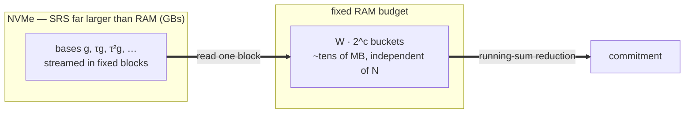

# snark-stream

**Out-of-core SNARK proving.** Compute the multi-scalar multiplications and KZG
commitments a SNARK prover is built on against a base set far larger than RAM, in
a fixed small memory budget, by streaming the bases through fast storage.

> A research artifact, and the sibling of [zk-stream](../zk-stream) (the STARK
> side). Same thesis — a prover's RAM is a dial, not a wall — carried into the
> pairing world. The scope limits are spelled out below; nothing here is a new
> proof system.

## Why

Every SNARK — Groth16, KZG-PLONK, Halo2, folding schemes — leans on the same two
heavy primitives: a multi-scalar multiplication over a fixed set of curve points,
and FFTs over the scalar field. The curve points are the SRS, or the proving key:
`O(N)` group elements, and for a circuit of `2^26..2^28` constraints over BN254
that is 4–25 GB of bases sitting in RAM. That is the prover's memory wall, and it
is exactly the part that does not need to be resident.

Pippenger's bucket method splits each scalar into `W` windows and routes each base
into one bucket per window. The buckets — `W · 2^c` points, a few tens of MB,
independent of `N` — are the only thing that has to stay hot. The bases pass
through once. Group addition is abelian, so the order they pass in doesn't change
the result: the streamed point is *bit-for-bit* the in-core one.

## What this proves

A streaming Pippenger MSM over BN254, verified bit-for-bit against arkworks'
`VariableBaseMSM`, in-core and streamed. Under an **enforced memory cgroup**
(swap off, spill to NVMe):

| MSM size | budget | in-core peak RSS | out-of-core peak RSS | same point? |
|----------|-------:|-----------------:|---------------------:|:-----------:|
| 2^22 | 256 MB | 1038 MB → **OOM-killed** | **99 MB** | ✓ (fp `3d1d…a249`) |
| 2^26 | 512 MB | 11586 MB → **OOM-killed** | **120 MB** | ✓ (fp `d6a3…b982`) |

A **67-million-point MSM over ~4 GB of bases, computed in 120 MB** — the same
group element the in-core prover would have produced, verified by running the
in-core path without a cgroup and matching the fingerprint. The resident set
tracks the bucket array, not `N`.

The bucket fill is parallelized across windows (each window owns a disjoint slice
of the bucket array, so no locks and the result stays bit-identical). It scales to
a handful of threads and then flattens: the scatter is bound by memory bandwidth,
not cores — so the pool is capped rather than grabbing the whole machine.
Out-of-core is a **memory lever, not a speed one**: streaming is slower than RAM;
it trades time for the ability to run at all.

## Out-of-core KZG commitment

A KZG commitment to a polynomial is `Σ aᵢ · [τⁱ]g` — the MSM of the coefficients
against the powers-of-tau SRS. arkworks' `KZG10::commit` with no hiding term *is*
that MSM. So streaming the SRS gives a streaming commitment with nothing new to
invent, and `commit_ooc` is checked bit-for-bit against arkworks' own
`KZG10::commit` (real trusted setup, degrees 1…255, chunk-wrapping). The 2^26 demo
above is exactly this: commit to a degree-2^26 polynomial whose SRS does not fit,
in 120 MB.

## Into a deployed prover: Halo2

The interesting question is whether this survives contact with a prover people
actually run. It does. `halo2-stream/` carries a surgical patch to PSE halo2's
`ParamsKZG`: every prover-time MSM over the SRS (the column commitments *and* the
SHPLONK opening) funnels through `commit` / `commit_lagrange`, so those two methods
stream from disk when the bases are disk-backed, and the rest of halo2 — keygen, the
prover, SHPLONK, the verifier — is untouched.

Measured on a real Halo2 KZG/SHPLONK proof (a PLONK add/mul chain filling `2^k`
rows), proving with the SRS in RAM versus streamed from disk:

| k | SRS in RAM | SRS on disk | Δ | proof |
|---|-----------:|------------:|--:|-------|
| 2^20 | 2762 MB | 2627 MB | −135 MB | identical, both verify |
| 2^22 | 10980 MB | 10378 MB | −602 MB | identical, both verify |

The proof is **byte-for-byte identical** to stock halo2 and verifies against the
stock verifier — streaming the SRS changes nothing the protocol can see. The
saving is exactly the SRS (`g` + `g_lagrange`), and it scales with `2^k`.

But it is only ~5 % of the prover's peak. The honest finding, which the numbers
make plain: on a deployed Halo2 prover the SRS is *not* the binding wall — the
proving key (1.7 GB at k=20, 6.8 GB at k=22 — fixed columns in extended-coset
form, the Lagrange selector polynomials, permutation cosets) and the
extended-domain quotient are. Out-of-core MSM removes the SRS wall, bit-identically
and without touching the proof; making Halo2 itself bounded-RAM needs those other
buffers out of core too. Details and reproduction in
[`halo2-stream/integration`](halo2-stream/integration).

## The quotient's buffers, out of core

The quotient is evaluated over the blown-up extended domain — that, and the
proving key it reads, are the buffers above. The primitives to stream them are
built and checked bit-for-bit against the real Halo2 oracle:

- a four-step (Bailey) FFT over `bn256::Fr` whose working set is one tile, not the
  whole transform — byte-for-byte `halo2curves::best_fft`;
- `coeff_to_extended` (the transform Halo2 runs on every advice / permutation /
  lookup polynomial) with the extended result left **on disk**, byte-for-byte
  `EvaluationDomain::coeff_to_extended`;
- the windowed tiling the evaluator reads through — a tile needs only a small halo
  around itself because the rotations are bounded — proven equal to direct access
  including the wrap at the domain boundary.

And the integration turns out *not* to be a rewrite of Halo2's evaluator. It reads
each coset at `(idx + rot·rot_scale) mod size`, so feeding it a window plus a
tile-local index — with `size` set to the window length, making the modulo a no-op
— reuses the existing constraint evaluation unchanged. `evaluate_h_ooc` does exactly
that: it evaluates the quotient over the extended domain in tiles, building each
tile's coset windows and calling Halo2's own gate evaluator on them — and folds in
the permutation, lookup, and shuffle arguments the same way (their `z(ωX)`, `±1`,
and last-row reads set the halo). On real Halo2 KZG/SHPLONK proofs — a custom-gate
circuit, an add/mul chain with copy constraints, a lookup circuit, and a shuffle
circuit — the out-of-core quotient is **byte-for-byte the in-core one** across tile
sizes down to a single row, and the proof verifies — checked inside the prover via
`SS_CHECK_OOC_H`. So a bounded-RAM Halo2 prover is not an open problem: the SRS
streams end to end on a real prover, and the quotient — now covering *every* Halo2
constraint term — is computed tile-by-tile, bit-identically, reusing Halo2's
evaluator unchanged.

`evaluate_h_ooc_disk` then sources those windows from disk: it spills each fresh
extended coset (advice, instance, the permutation / lookup / shuffle product
polynomials) to a scratch file one at a time and reads back a window per tile, and
streams the output accumulator to disk a tile at a time — so where in-core
`evaluate_h` holds every fresh coset *and* the whole accumulator resident at once,
this holds at most one coset plus an `O(tile)` window. It is checked byte-for-byte
identical inside the prover (`SS_CHECK_OOC_DISK`), down to a one-row tile, on all
four constraint kinds. Measured *in isolation* (the quotient alone, under an
enforced cgroup, swap off, spilling to NVMe — a wide custom-gate circuit at
`k = 18` with 96 advice columns):

| quotient | budget | peak RSS | same `h`? |
|----------|-------:|---------:|:---------:|
| in-core  | 1536 MB | 2458 MB → **OOM-killed** | ✓ (fp `23dd…fe87`) |
| disk     | 1536 MB | **939 MB** | ✓ (fp `23dd…fe87`) |

Same quotient, identical to the last byte; the in-core path is killed at the budget
the disk path completes in. (Inside Halo2's *full* prover the saving doesn't move
the process peak — the quotient is not the binding phase there, and the allocator
keeps earlier phases' high-water mark — exactly as streaming the SRS saved its 5 %.
The bounded-RAM win is the quotient *computation itself*, which is what a from-scratch
out-of-core prover is built around.)

## On upstream zcash/halo2

Everything above is the PSE KZG/SHPLONK fork. The same idea holds on the original
`zcash/halo2` (IPA, no trusted setup) — whose prover computes the quotient with a
*different* engine: the chunked `poly::Ast` evaluator, not the per-row one. It
registers every coset and evaluates the constraint AST over the extended domain in
parallel chunks, holding all cosets resident at once. `evaluate_ooc` spills each
registered coset to disk and reads only the chunk window each `Ast` leaf needs, so
they need not all be resident — **byte-for-byte identical** to in-core `evaluate`
across the whole `halo2_proofs` test suite (custom gates, copy constraints, lookups),
checked via `SS_CHECK_OOC`. So the out-of-core quotient isn't specific to the KZG
fork or to one evaluator design; it holds on the canonical halo2 prover too. The
fork is vendored at `halo2-zcash/`; patch and steps in
[`halo2-stream/integration`](halo2-stream/integration).

## Scope — what this is and isn't

- **A systems contribution, not a new algorithm.** The streamed result is
  bit-identical to the in-core one; the lever is *where the bases live*, not how
  the math works. arkworks' `gemini` (a space-efficient SNARK) and bellperson's
  disk-backed MSM are prior art for the idea; the angle here is making the
  *deployed* univariate provers out-of-core without changing protocol, proof, or
  verifier.
- **A memory lever, not speed.** Streaming is slower than RAM. It matters only
  when RAM is the thing you don't have — client-side and mobile proving, or
  circuits too big for the machine.
- **The demonstrable artifact is server-side** (big instance, bounded RAM, NVMe,
  cgroup). Mobile flash-spill is the motivation, not something tested here.

## Layout

- `src/` — the BN254 (arkworks) core: streaming Pippenger MSM, out-of-core KZG
  commitment, and the `gen`/`incore`/`ooc` demo behind the GIF.
- `halo2-stream/` — the same MSM over halo2curves `bn256` (generic over the curve),
  the four-step `coeff_to_extended` and the windowed/disk coset primitives the tiled
  quotient reads through, and (`integration/`) the Halo2 patch, measurement demo,
  and results.
- `halo2-fork/` — a vendored PSE-halo2 fork (commit `198e9ae`) with the patch
  applied, so the measurement demo builds with `cargo build -p ooc-demo` and no
  separate checkout. Stock except `halo2_backend` and the `ooc-demo` crate; the
  diff is `halo2-stream/integration/halo2-params-streaming.patch`.
- `halo2-zcash/` — a vendored upstream `zcash/halo2` fork (commit `261faac`,
  trimmed to `halo2_proofs`) with the out-of-core quotient added to its `poly::Ast`
  evaluator, checked bit-identical via `SS_CHECK_OOC=1 cargo test -p halo2_proofs`.
  The diff is `halo2-stream/integration/halo2-zcash-quotient-ooc.patch`.

Every out-of-core path is checked bit-for-bit against an in-core oracle
(arkworks, or halo2curves `msm_best`) before it counts, and every memory figure is
measured under an enforced cgroup with swap off. `/var/tmp` is real NVMe.

## License

MIT OR Apache-2.0.
